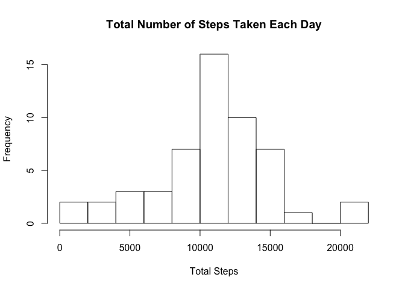
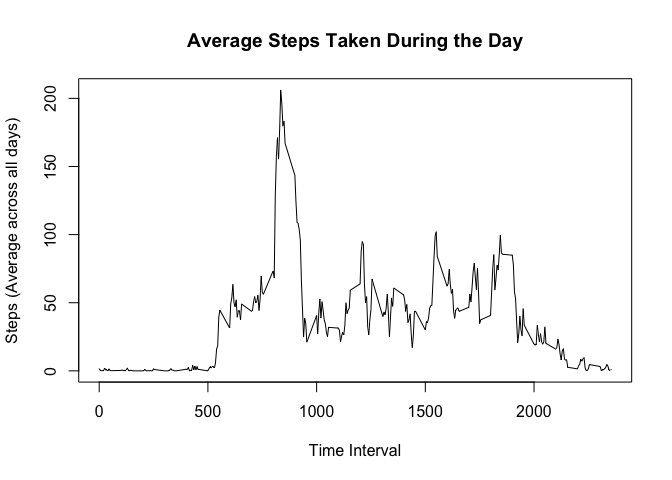
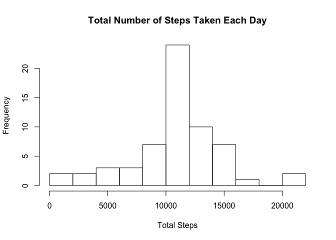
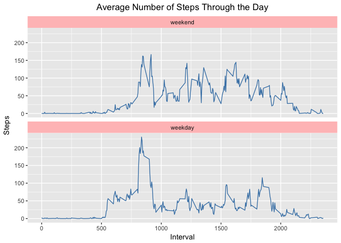

# Reproducible Research: Peer Assessment 1

## Loading and preprocessing the data
Load packages

```r
library(dplyr)
library(ggplot2)
```

Load the data

```r
data_activity <- read.csv("activity.csv")
```

Process data: Format date

```r
data_activity$date <- as.Date(data_activity$date)
head(data_activity)
```

```
##   steps       date interval
## 1    NA 2012-10-01        0
## 2    NA 2012-10-01        5
## 3    NA 2012-10-01       10
## 4    NA 2012-10-01       15
## 5    NA 2012-10-01       20
## 6    NA 2012-10-01       25
```

## What is the mean total number of steps taken per day?
1. Calculate the total number of steps taken per day

```r
# Total steps by day
totalsteps <- data_activity %>%
  group_by(date) %>%
  summarise(total.steps = sum(steps))

totalsteps
```

```
## # A tibble: 61 × 2
##          date total.steps
##        <date>       <int>
## 1  2012-10-01          NA
## 2  2012-10-02         126
## 3  2012-10-03       11352
## 4  2012-10-04       12116
## 5  2012-10-05       13294
## 6  2012-10-06       15420
## 7  2012-10-07       11015
## 8  2012-10-08          NA
## 9  2012-10-09       12811
## 10 2012-10-10        9900
## # ... with 51 more rows
```

2. Make a histogram of the total number of steps taken each day

```r
hist(totalsteps$total.steps, main = "Total Number of Steps Taken Each Day", xlab = "Total Steps", breaks = 10)
```

<!-- -->

3. Calculate and report the mean and median of the total number of steps taken per day

```r
totalsteps_mean <- mean(totalsteps$total.steps, na.rm = TRUE)
totalsteps_median <- median(totalsteps$total.steps, na.rm = TRUE)
```
**The mean of the total number of steps taken per day is 1.0766189\times 10^{4}**
**The median of the total number of steps taken per day is10765**

## What is the average daily activity pattern?
1. Make a time series plot(i.e. type = "l") of the 5-minute interval (x-axis) and the average number of steps taken, averaged across all days (y-axis)

```r
byinterval <- data_activity %>%
  group_by(interval) %>%
  summarise(dailyintervalsteps = mean(steps, na.rm = TRUE))

with(byinterval, plot(interval, dailyintervalsteps, type = "l", main = "Average Steps Taken During the Day", xlab = "Time Interval", ylab = "Steps (Average across all days)"))
```

<!-- -->


2. Which 5-minute interval, on average across all the days in the dataset, contains the maximum number of steps?

```r
byinterval$rank <- rank(-byinterval$dailyintervalsteps)
maxsteps <- subset(byinterval, rank==1)
```
**The maximum average number of steps occurs at the interval 835 with 206.1698113 steps.**

## Imputing missing values
1. Calculate and report the total number of missing values in the dataset (i.e. the total number of rows with NAs)

```r
countNA <- sum(is.na(data_activity$steps))
countNA
```

```
## [1] 2304
```
**The total number of missing values in the dataset is `countNA`**

2. Devise a strategy for filling in all of the missing values in the dataset.

**Missing values will be filled using the mean for that 5-minute interval.**

```r
index.missing <- which(is.na(data_activity$steps))
data_imputed <- data_activity

for(i in 1:length(index.missing)){
  data_imputed$steps[index.missing][i] <- byinterval$dailyintervalsteps[byinterval$interval == data_imputed$interval[index.missing][i]]
}

# Check all missing values imputed
cat("All missing values imputed?", sum(is.na(data_imputed$steps)) == 0 )
```

```
## All missing values imputed? TRUE
```

```r
#View(data_imputed)
```

3. Create a new dataset that is equal to the original dataset but with the missing data filled in.
**The new dataset `data_imputed` is created from the original dataset with missing data replaced with the mean of the corresponding 5-minute interval.**

4. Make a histogram of the total number of steps taken each day and calculate and report the **mean** and **median** total number of steps taken per day. Do these values differ from the estimates from the first part of the assignment? What is the impact of imputing missing data on the estimates of the total daily number of steps?

```r
totalsteps2 <- data_imputed %>%
  group_by(date) %>%
  summarise(total.steps = sum(steps))

hist(totalsteps2$total.steps, main = "Total Number of Steps Taken Each Day", xlab = "Total Steps", breaks = 10)
```

<!-- -->

```r
totalsteps2_mean <- mean(totalsteps2$total.steps, na.rm = TRUE)
totalsteps2_median <- median(totalsteps2$total.steps, na.rm = TRUE)
```

**The mean of the total number of steps taken per day with imputed data is 1.0766189\times 10^{4}**
**The median of the total number of steps taken per day with imputed data is1.0766189\times 10^{4}**
**Compared to the original data, the imputed data retains the same mean value. However, the median of the imputed data is now equivalent to the mean of the dataset, an increase from the original median. Also, the _total_ daily number of steps is increased. This does not come as a surprise since we are adding values into the data.** 

## Are there differences in activity patterns between weekdays and weekends?
For this part the `weekdays()` function may be of some help here. Use the dataset with filled-in missing values for this part.

1. Create a new factor variable in the dataset with two levels - "weekday" and "weekend" indicating whether the given date is a weekday or a weekend day.

```r
weekend <- c('Saturday', 'Sunday')

data_imputed$weekday <- factor(weekdays(data_imputed$date) %in% weekend, levels = c(TRUE, FALSE), labels = c("weekend", "weekday"))
```

2. Make a panel plot containing a time series plot (i.e. `type= "l"`) of the 5-minute interval (x-axis) and the average number of steps taken, averaged across all weekday days or weekend days (y-axis). See the README file in the GitHub repository to see an example of what this plot should look like using simulated data.

```r
byIntDay_imputed <- aggregate(steps ~ interval + weekday, data = data_imputed, mean)
ggplot(byIntDay_imputed, aes(interval, steps)) + 
  geom_line(color = "steelblue") + 
  facet_wrap(~weekday, nrow = 2) + 
  ggtitle("Average Number of Steps Through the Day") + xlab("Interval") + ylab("Steps") +
  theme(plot.title = element_text(hjust = 0.5), strip.background = element_rect(fill = "rosybrown1"))
```

<!-- -->
